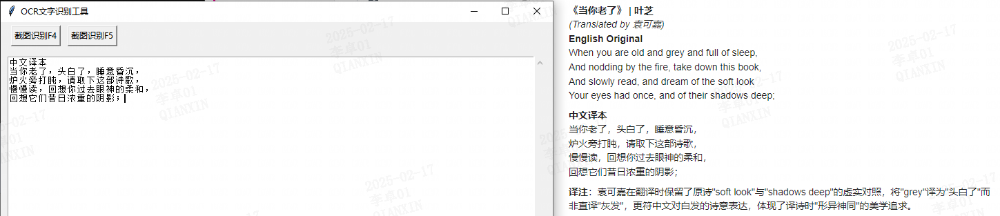
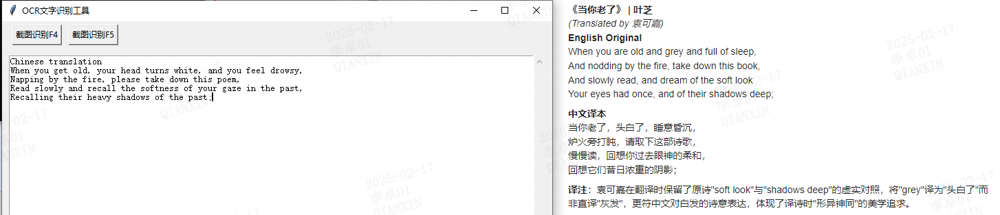

# KzOCR
一款基于python开发的文本识别ORC工具，目前完成了两个功能：1，调用阿里云ocr接口完成图片识别。2，调用百度翻译接口，实现自动识别中英文互译。

# OCR功能介绍：
阿里云OCR 免费100次，第一次购买500次只需要1分钱。相当于免费600次。
https://market.aliyun.com/apimarket/detail/cmapi028554
在代码的开始，需要手动配置阿里云OCR的APP_CODE.
APP_CODE = "XXX"
配置完成后，在命令行使用 python KzOCR.py 运行打开图形化页面，使用F4快捷键即可快速截图选中文字进行识别，识别结果自动出现在文本框中。

# 翻译功能介绍：
对于文本框中的文字，可以使用快捷键F5进行翻译。翻译结果自动出现在文本框中。本翻译功能目前写死了自动识别中英文，并进行中英文互翻。
需要手动配置百度api的APP_CODE.
            # 百度API配置
            appid = 'xx'  #自己的id
            appkey = 'xx' #自己的key
            url = 'https://fanyi-api.baidu.com/api/trans/vip/translate'
可以去https://api.fanyi.baidu.com/manage/developer
个人用户实名后，一个月有100万字符免费翻译。

